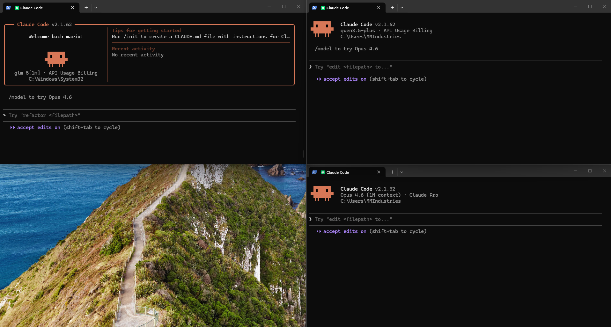

<p align="center">
  
</p>

# Alibaba Cloud Coding Plan - Linux Configuration

Configura Claude Code en entornos Linux/WSL para utilizar los modelos de Alibaba Cloud Model Studio Coding Plan.

## Modelos Soportados

| Rol de Claude | Modelo Alibaba | Vision | Proposito |
| :--- | :--- | :--- | :--- |
| **Opus** (Reasoning) | `qwen3.5-plus` | Si | Razonamiento complejo y analisis visual. |
| **Sonnet** (Coding) | `kimi-k2.5` | Si | Programacion y edicion con soporte visual. |
| **Haiku** (Fast) | `MiniMax-M2.5` | No* | Tareas rapidas. |

> *MiniMax-M2.5 requiere skill adicional para procesamiento de imagenes.

## Instalacion

```bash
# 1. Copia el script a tu entorno Linux
cp resources/setup_alibaba_linux.sh ~/setup_alibaba.sh

# 2. Edita el archivo y reemplaza {{API_KEY}} con tu API Key
nano ~/setup_alibaba.sh

# 3. Ejecuta el script
chmod +x ~/setup_alibaba.sh
./~/setup_alibaba.sh

# 4. Recarga tu terminal
source ~/.bashrc
```

## Uso

```bash
alibaba
```

## Cambio de Modelos

```
/model qwen3-coder-next
/model kimi-k2.5
/model MiniMax-M2.5
```

## Obtener API Key

1. Ve a https://bailian.console.aliyun.com/
2. Suscribete a Coding Plan (Lite $3 o Pro $15)
3. Genera tu API Key (formato `sk-sp-xxxxx`)

## Cuotas del Plan

| Plan | Precio | Requests/mes |
| :--- | :--- | :--- |
| **Lite** | $3 | 18,000 |
| **Pro** | $15 | 90,000 |

## Licencia

MIT License
